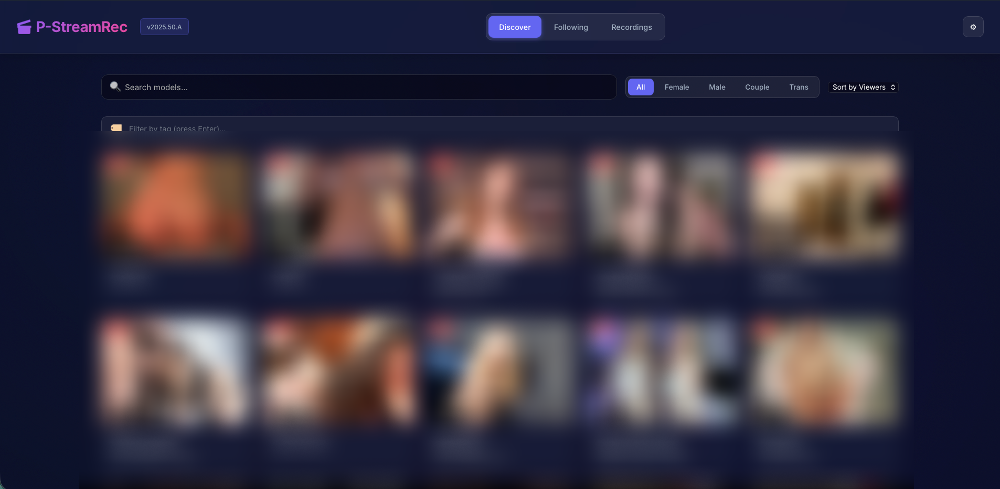

# P-StreamRec

[](LICENSE)
[](https://www.docker.com/)
[](https://github.com/raccommode/P-StreamRec)

**Automatic Chaturbate & m3u8 stream recorder with a modern web interface.**

## Features

- **24/7 automatic recording** — monitors models and records when they go live
- **Auto MP4 conversion** — converts TS to compressed MP4 in background (50-70% smaller)
- **Discover** — browse live Chaturbate models with gender, tag, and search filters
- **Following** — sync and view your followed models from your Chaturbate account
- **Recordings** — manage all recordings with built-in video player
- **Live Watch** — watch streams directly in the browser with HLS player
- **Chaturbate auth** — login for better stream quality and followed models sync
- **FlareSolverr** — automatic Cloudflare bypass via dedicated container
- **Settings** — manage account, FlareSolverr status, tag blacklist
- **Password protection** — optional login to secure the interface
- **GitOps updates** — update the app directly from the UI
- **Docker ready** — one command to get started

## Screenshots

| Discover | Following | Recordings |
|----------|-----------|------------|
|  |  |  |

## Quick Start

### Docker Compose (recommended, includes FlareSolverr)

```yaml
version: "3.8"
services:
  flaresolverr:
    image: ghcr.io/flaresolverr/flaresolverr:latest
    environment:
      - LOG_LEVEL=info
    ports:
      - "8191:8191"
    restart: unless-stopped

  p-streamrec:
    image: ghcr.io/s--p/p-streamrec:latest
    depends_on:
      - flaresolverr
    environment:
      - CB_RESOLVER_ENABLED=true
      - FLARESOLVERR_URL=http://flaresolverr:8191
    ports:
      - "8080:8080"
    volumes:
      - ./data:/data
    restart: unless-stopped
```

### Docker Run (simple)

```bash
docker run -d --name p-streamrec \
  -p 8080:8080 -v ./data:/data \
  -e CB_RESOLVER_ENABLED=true \
  ghcr.io/s--p/p-streamrec:latest
```

**Access:** `http://localhost:8080`

## Configuration

| Variable | Default | Description |
|----------|---------|-------------|
| `OUTPUT_DIR` | `/data` | Recordings folder |
| `PORT` | `8080` | Web interface port |
| `FFMPEG_PATH` | `ffmpeg` | Path to FFmpeg |
| `CB_RESOLVER_ENABLED` | `true` | Enable Chaturbate support |
| `CB_REQUEST_DELAY` | `1.0` | Delay between Chaturbate requests (seconds) |
| `PASSWORD` | — | Password to protect the interface (optional) |
| `AUTO_RECORD_USERS` | — | Comma-separated usernames to auto-record |
| `CHATURBATE_USERNAME` | — | Chaturbate login (optional, enables Following + better quality) |
| `CHATURBATE_PASSWORD` | — | Chaturbate password (optional) |
| `FLARESOLVERR_URL` | — | FlareSolverr URL (e.g. `http://flaresolverr:8191`) |
| `AUTO_CONVERT_WHILE_RECORDING` | `false` | Convert only when no live recording is active |
| `CONVERT_MODE` | `reencode` | `reencode` (x264), `copy` (no re-encode), `qsv` (Intel QuickSync), `vaapi` (Intel VAAPI) |
| `CONVERT_QSV_DEVICE` | `/dev/dri/renderD128` | QSV render device path inside container |
| `CONVERT_PRESET` | `medium` | FFmpeg preset for `reencode`/`qsv` |
| `CONVERT_CRF` | `23` | Quality target for `reencode` mode |
| `CONVERT_COPY_AUDIO` | `true` | Copy audio stream instead of re-encoding |
| `CONVERT_AUDIO_BITRATE` | `128k` | Audio bitrate when audio is re-encoded |
| `LIBVA_DRIVER_NAME` | `iHD` | Intel VA driver used by FFmpeg/QSV |
| `TZ` | `UTC` | Timezone (e.g. `America/Toronto`) |

## Usage

1. **Add a model** — click **+**, enter a Chaturbate username or m3u8 URL
2. **Auto-record** — the system checks every 2 minutes and records when live
3. **Auto-convert** — when the stream ends, TS is converted to MP4 automatically
4. **CPU-friendly queue behavior** — by default, conversion waits while live recordings are running
5. **Watch live** — click a model card to open the live player
6. **Browse replays** — go to the Recordings page to watch or delete recordings

### Recording format

- Original: `/data/records/<username>/YYYYMMDD_HHMMSS_ID.ts` (MPEG-TS, lossless)
- Converted: `/data/records/<username>/<username>YYYYMMDD_HHMMSS_recorded.mp4` (H.264, auto-generated)

### Storage estimates

| Format | Size per hour |
|--------|---------------|
| TS (original) | ~2–4 GB |
| MP4 (converted) | ~600 MB–1.2 GB |

## Development

```bash
git clone https://github.com/raccommode/P-StreamRec.git
cd P-StreamRec
python -m venv .venv && source .venv/bin/activate
pip install -r requirements.txt
uvicorn app.main:app --reload
```

**Stack:** FastAPI, SQLite (aiosqlite), HLS.js, FFmpeg, Docker

## License

**Non-Commercial Open Source License** — See [LICENSE](LICENSE)

Free to use, modify, and distribute — **no commercial use** — share modifications under same license — attribution required
